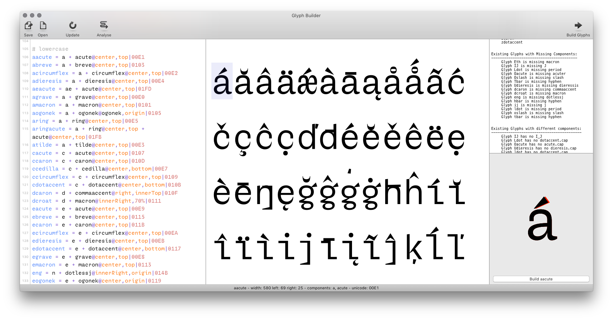

Glyph Construction
==================

**Glyph Construction is a simple, powerful, human-readable language for describing how glyph shapes are built.**

Glyph Construction can be used to create new glyphs from components. It is specially useful for creating accented glyphs.

Collections of Glyph Construction rules can be saved as `*.glyphConstruction` files, and can be shared between fonts.

This repository contains:

<dl>
<dt><a href='Lib/glyphConstruction.py'>glyphConstruction module</a></dt>
<dd>A Python library to parse glyph construction rules and build new glyphs in a given font.</dd>
<dt><a href='GlyphConstruction.roboFontExt'>Glyph Construction extension</a></dt>
<dd>A RoboFont extension which includes the Glyph Builder, a visual glyph construction editor with live preview.</dd>
</dl>

Table of Contents
-----------------

- [Glyph Construction language](#glyph-construction-language)
    - [Assigning a construction to a glyph](#assigning-a-construction-to-a-glyph)
    - [Comments](#comments)
    - [Notes](#notes)
    - [Unicodes](#unicodes)
    - [Mark Color](#mark-color)
    - [Metrics](#metrics)
        - [Width](#width)
        - [Left and Right Margins](#left-and-right-margins)
    - [Decompose glyph](#decompose-glyph)
    - [Ignore existing glyphs](#ignore-existing-glyphs)
    - [Positioning](#positioning)
        - [By Numbers](#by-numbers)
        - [By Percentages](#by-percentages)
        - [By Reference](#by-reference)
        - [By Transformation Matrix](#by-transformation-matrix)
        - [Change the current glyph](#change-the-current-glyph)
        - [Flipping](#flipping)
    - [Stacking Vertically](#stacking-vertically)
    - [Positioning formulas](#positioning-formulas)
    - [Stacking Horizontally](#stacking-horizontally)
        - [Apply kerning while stacking horizontally](#apply-kerning-while-stacking-horizontally)
    - [Variables](#variables)
- [Glyph Builder interface](#glyph-builder-interface)
    - [Toolbar](#toolbar)
    - [Rules editor](#rules-editor)
    - [Preview](#preview)
    - [Analysis](#analysis)
    - [Selection preview](#selection-preview)
    - [Status bar](#status-bar)

- - -

Glyph Construction language
---------------------------

### Assigning a construction to a glyph

Build `<destGlyphName>` out of one or more components.

    <destGlyphName> = <glyphName> + <glyphName>
    Aacute = A + acute

Optionally, a suffix can be provided. If a glyph with the given suffix does not exist in the font, the suffix is ignored.

    Aacute = A + acute.cap

### Comments

A line starting with (or anything after) a `#` is a comment and will not be used during execution.

    # this is a comment
    Aacute = A + acute
    Agrave = A + grave # this is a note

### Notes

A comment `#` at the end of a glyph construction is a note.

    <destGlyphName> = <glyphName> + <glyphName> # <note>
    Aacute = A + acute # this is a note

### Unicodes

    <destGlyphName> = <glyphName> + <glyphName> | <unicode>
    Aacute = A + acute | 00C1

### Mark Color

    <destGlyphName> = <glyphName> + <glyphName> ! <rgba>
    Aacute = A + acute ! 1, 0, 0, 1

### Metrics

#### Width

    <destGlyphName> = <glyphName> + <glyphName> ^ <width>
    Aacute = A + acute ^ 400

#### Left and Right Margins

    <destGlyphName> = <glyphName> + <glyphName> ^ <leftmargin>, <rightMargin>
    Aacute = A + acute ^ 30, 30

Width and margin values can also be defined using basic maths and references to `width`, `leftMargin` or `rightMargin` of other glyphs.

    # width is equal to twice the width of A
    Aacute = A + acute ^ A * 2

    # left margin is equal to one third of the left margin of A
    # right margin is equal to twice the right margin of B
    Aacute = A + acute ^ A / 3, B * 2

### Decompose glyph

Add `*` before a glyph construction rule to explicitly tell the constructor to decompose the final result.

    *agrave = a + grave

### Ignore existing glyphs

Add `?` before a glyph construction rule to ignore this glyph if it already exists in the font.

    ?Aacute = A + acute

### Positioning

The Glyph Construction language offers different ways to position the added components in relation to the current glyph.

#### By Numbers

    Aacute = A + acute@100
    Aacute = A + acute@100,100

#### By Percentages

    Aacute = A + acute@50%,50%

#### By Reference

    Aacute = A + acute@center,top

A reference could be (in this order):

- double anchor (with the `_<anchorName>` notation)
- a single anchor name
- a local guide name
- a global guide name
- a font dimension attribute: `descender`, `xHeight`, `capHeight`, `ascender`
- a calculated reference position: `top`, `bottom`, `left`, `right`, `innerLeft`, `innerRight`, `center`, `origin`, `width`

#### By Transformation Matrix

`@` followed by a transformation matrix: 6 values `xx, xy, yx, yy, x, y`

    Aacute = A + acute@1, 0, 0, 1, 100, 100

#### Change the current glyph

The current glyph is always the last component added.

For example, `Aacute = A + acute` will:

- add component with name `A` (there is no current glyph)
- add component with name `acute` (the current glyph is `A`)

Force the current glyph with `@<glyphName>:<pos>`:

    Ocircumflexdotaccent =  O + circumflex@center,top + dotaccent@O:center,bottom

The forced `glyphName` can also be escapped with `"` in case the glyph name
contains a `:`

    Ocircumflexdotaccent =  O + circumflex@center,top + dotaccent@"O:latn":center,bottom

#### Flipping

`~` followed by a position will flip a component:

    # flip horizontally
    Aacute = A + acute@~center,top

    # flip vertically
    Aacute = A + acute@center,~top

    # flip both horizontally and vertically
    Aacute = A + acute@~center,~top

### Stacking Vertically

    Aringacute = A + ring@center,top + acute@center,top

### Positioning formulas

    Aringacute = A + ring@center,`top+10` + acute@center,`top-10`

### Stacking Horizontally

    ffi = f & f & i

#### Apply kerning while stacking horizontally

Start a sub-glyphConstruction with a backslash to indicate kerning should be applied while stacking horizotally.

    A_V = A &\ V

### Variables

Glyph Construction supports variables, which can be defined once at the top of the document and used multiple times.

    $name = something # declaration
    {name} # usage

    $myColorMark = 1, 0, 0, 1 # declaration
    agrave = a + grave@center,top ! {myColorMark} # usage

- - -

Glyph Builder interface
-----------------------

To install the Glyph Construction extension in RoboFont, follow the instructions provided in the links below:

- [Installing extensions manually](http://robofont.com/documentation/extensions/installing-extensions/)
- [Installing extensions with Mechanic 2](http://robofont.com/documentation/extensions/installing-extensions-mechanic/)

Once the extension is installed, the Glyph Builder can be opened from the menu *Extensions > Glyph Construction*.

Here’s a description of each part of the Glyph Builder interface:

### Toolbar

The toolbar at the top of the window gives access to the following actions:

<dl>
    
<dt>Save</dt>
<dd>Save all rules as a <code>.glyphConstruction</code> file.</dd>

<dt>Open</dt>
<dd>Open an existing <code>.glyphConstruction</code> file.</dd>

<dt>Update</dt>
<dd>Update the contents of the <em>Preview</em> and <em>Analysis</em> columns.</dd>

<dt>Analyse</dt>
<dd>Show/hide the <em>Analysis</em> column.</dd>
                       
<dt>Build Glyphs</dt>
<dd>Build all described glyphs in the current font.</dd>

<dt>Build</dt>
<dd>Build only the selected glyph.</dd>

</dl>

### Rules editor

The left column contains a simple text editor where Glyph Construction rules can be written, one per line.

See [Glyph Construction language](#glyph-construction-language) for syntax documentation and examples.

### Preview

The middle column displays a preview for every glyph construction rule defined in the left column.

The preview supports zooming in/out with ⌘ +/- keys or with the mouse.

Individual glyphs can be selected with a click – see *Selection preview* (below).

### Analysis

The right column displays useful information about the glyph construction rules defined in the editor: missing and existing glyphs, existing glyphs with missing components, and existing glyphs with different components.

### Selection preview
 
At the bottom of the right column is a preview of the glyph which is currently selected in the preview area.

If the glyph already exists in the font, its current shape is displayed in the background in red for comparison.

### Status bar

The status bar at the bottom of the window displays information about the currently selected glyph: glyph name, width, left and right margins, component names, unicode, mark color, and note.
